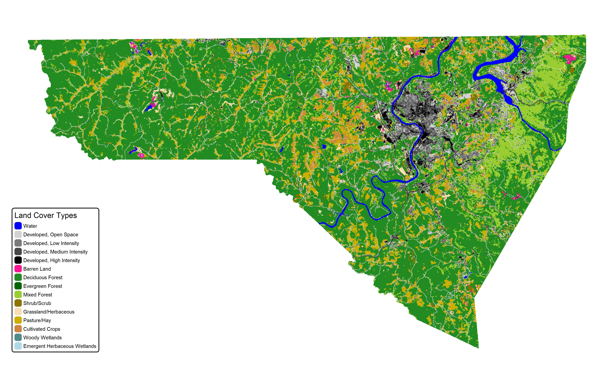

# Unsupervised Land Cover Classification of Monongalia County, WV

## Introduction

For this project I analyzed satellite imagery of Monongalia County. I wanted to try to identify/uncover land cover patterns that weren't represented in previous land cover datasets. By using K-means to segment and group pixels based band values I was able to gain knowledge about possibly discovered new land cover patterns.

## Methods

### Data Used

The data I use for this analysis included:

- 30m Landsat, bands - RGB and infa-red (USGS/EROS) from date: 10/2024
- 30m 2021 NLCD

### Analysis

Multiple clustering analyses were performed. For the K-means, the `k_means()` method part of `library(terra)` was used. For the number of clusters I ran the analysis with 14, 16, 18, and 20 clusters. I chose these cluster numbers because based on the land cover data, there were 16 land cover types present in Monongalia County. Since I wanted to try to find new patterns and features, I decided to analyze cluster counts around or above the number of pre-existing land cover types. After running the clustering to analyze the output I changed the symbology/colors of the output and cross analyzed it with a map of the NLCD land cover data and the original imagery.

## Results

With the NLCD map and the original image as a reference;

### NLCD Map

### Original Image

### 14 Cluster Analysis

### 16 Cluster Analysis

### 18 Cluster Analysis

### 20 Cluster Analysis

### Patterns Found

Looking at the image, you can see that there is a greener wall of forest/vegetation on the eastern part of the county. On the clustering outputs, the area looks to be made up of multiple groups. This feature is found in all the other clustering analysis, regardless of the value of the n cluster parameter. Another feature present in all the analysis is what looks like a group for water bodies. Barren/mountain top mining land looks like it got a grouped into more of the devolved and industrial areas. The areas that were classes as developed look to grouped into two clusters.

## Discussion

After looking at the results of the clustering analysis, it can be said that there are more/more specific forest and vegetation types in Monongalia County then represented in the NLCD map. I think this is partly due to the way the NLCD is made. It is a land cover dataset that is meant to represent the entire USA in about 20 land classes as accurately as it can, so using more generic classes is probably better for that job. The results show that the NLCD might under-represent the diversity of the natural land cover types and over-specified the man-made land cover types, when applied to Monongalia County. Even when making fewer clusters then there are NLCD classes present in the county, the analysis shows that multiple clusters are being grouped on areas previously thought to be just one forest/vegetation type. And when adding groups these groups are still well defined. In other words, the NLCD might be under representative of Monongalia County's diversity of forest/vegetation types. I think that if a future study wanted to use land cover data in their analysis, and they wanted the data to be representative of the ecology of the county they might consider creating their own land cover for the county.

## Conclusion

To conclude my analysis, I found that there might be more diverse or specific types of forest, vegetation, and natural land cover types in Monongalia County compared to what is shown in the NLCD. With that being said, given the unsupervised-ness of the clustering method used, K-means, we can't know for sure how the results of the analysis were found, except that if you cross examine the results with the NLCD and original image, the results make sense. In conclusion, I think that given the results, if I was to do an analysis of Monongalia County where I was going to use land cover data, I would use or create a different land cover dataset that was more representative to the features found in the results.

## Sources

NLCD - https://www.mrlc.gov/viewer/

Landsat - https://landsat.gsfc.nasa.gov/data/data-access/
